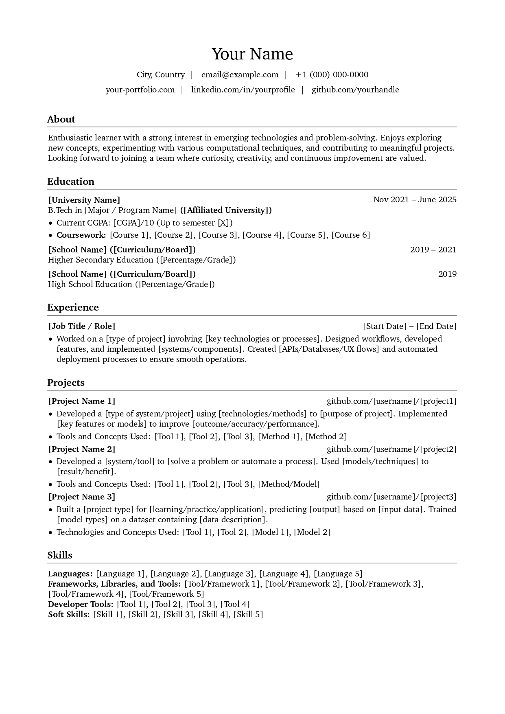

<p align="center">
  
</p>

---

A minimal, version-controlled LaTeX resume template bundled with a lightweight Docker setup. It lets you build your resume consistently on any machine without installing a full TeX environment.

<p align="center">
  
</p>

## Setup

1. **Install Docker**

   Make sure Docker is installed and running on your system.

2. **Fork and clone this repository**

   ```bash
   git clone https://github.com/your-github-username/resume-kit.git
   cd resume-kit
   ```

3. **Build the Docker image**

   This installs the minimal TeX Live environment inside the container:

   ```bash
   make image
   ```

4. **Build the résumé PDF**

   This compiles `src/main.tex` inside the Docker container and places the output in the `build/` directory.

   ```bash
   make build
   ```

   After running this, you'll find:

   ```
   build/main.pdf
   ```

5. **Clean the build directory (optional)**

   If you want to remove all generated files and start fresh:

   ```bash
   make clean
   ```

## Editing the Resume

1. **Open the project in a text editor**
   
   Use any editor you like, but VS Code works best for LaTeX workflows.

2. **Start live preview using the Docker watcher**
   
   Run:

   ```bash
   make watch
   ```

   The PDF in the `build/` directory will regenerate automatically whenever you save changes.
   
   *Tip:* Split the editor window — keep the `.tex` file on one side and the generated PDF (from `build/main.pdf`) on the other. You’ll see updates as soon as the document recompiles.

3. **Edit only the content sections**
   
   All customization happens inside the files below:

   ```
   src/
   ├── main.tex
   └── sections/
       ├── 01_Header.tex
       ├── 02_Introduction.tex
       ├── 03_Education.tex
       ├── 04_Experience.tex
       ├── 05_Projects.tex
       ├── 06_Skills.tex
       ├── 07_Certifications.tex
       ├── 08_Publications.tex
       ├── 09_Achievements.tex
       └── 10_Reference.tex
   ```

   Basic LaTeX syntax familiarity is enough to edit these files.


Here’s a clean, straightforward section explaining **how to customize the order**, **add/remove fields**, and **modify metadata** — all based directly on your `main.tex` structure.

---

## Customizing Sections

Your resume layout is controlled entirely by `src/main.tex`.
Every section of your resume is included using LaTeX `\input{...}` statements:

```tex
\input{sections/01_Header}
\input{sections/02_Introduction}
\input{sections/03_Education}
\input{sections/04_Experience}
\input{sections/05_Projects}
\input{sections/06_Skills}
\input{sections/09_Achievements}
\input{sections/08_Publications}
\input{sections/07_Certifications}
\input{sections/10_Reference}
```

### Changing the Order

You can rearrange your resume simply by moving these lines up or down.
Example: putting Projects above Experience:

```tex
\input{sections/01_Header}
\input{sections/05_Projects}
\input{sections/04_Experience}
```

No other changes are required — LaTeX will compile in the exact order you place them.

---

## Adding a New Section

1. Create a new `.tex` file inside `src/sections/`, for example:

   ```
   src/sections/11_Volunteering.tex
   ```

2. Write your LaTeX content in that file.

3. Add it to `main.tex` anywhere you want it to appear:

   ```tex
   \input{sections/11_Volunteering}
   ```

That’s all — the new section becomes part of the resume.

---

## Removing a Section

Just delete or comment out the corresponding line in `main.tex`.
Example: remove Publications:

```tex
% \input{sections/08_Publications}
```

You don’t need to delete the actual `.tex` file unless you want to.

---

## Editing PDF Metadata (Title, Author, Keywords)

At the top of `main.tex`, you’ll see:

```tex
\renewcommand{\ResumeTitle}{Resume of "Your Name"}
\renewcommand{\ResumeAuthor}{Your Name}
\renewcommand{\ResumeKeywords}{resume, curriculum vitae, portfolio, website=https://www.github.com/don-sabu/resume-kit}
```

Update these values to match your identity:

* `\ResumeTitle` → Display title of the resume
* `\ResumeAuthor` → Your name
* `\ResumeKeywords` → Metadata for the PDF, useful for indexing/search

Example:

```tex
\renewcommand{\ResumeTitle}{Resume of John Doe}
\renewcommand{\ResumeAuthor}{John Doe}
\renewcommand{\ResumeKeywords}{resume, software engineer, backend developer}
```


## Adjusting Page Borders (Margins)

Page margins are controlled inside `src/resume.cls` on lines 11–19:

```tex
% Page geometry
\RequirePackage[
    ignoreheadfoot,
    top=2cm,
    bottom=2cm,
    left=2cm,
    right=2cm,
    footskip=1cm,
]{geometry}
```

To make the layout narrower (more space on the page), change the margin values.
For example, set everything to **1 cm**:

```tex
top=1cm,
bottom=1cm,
left=1cm,
right=1cm,
```

That’s it — the next build will use the new borders.

**Be careful when editing `resume.cls`.**

This file controls the structure and styling of the entire template. A bad edit can break the formatting, so make small changes and test with `make watch`.


## Git Workflow (Versioned PDF Builds)

Once you’ve edited your résumé and confirmed the PDF looks right locally, follow this workflow to produce a versioned release on GitHub.

### 1. Make changes

Edit whichever `.tex` files you need.

### 2. Commit your changes

```sh
git add .
git commit -m "Describe the update you made"
```

### 3. Create a tag

Only **tagged** commits trigger the GitHub workflow that builds and uploads the PDF as a release.
Tag format is completely up to you, but this is the style I use:

* `v2025.11.1_one_page`
* `v2025.11.2_company_name`
* `v2026.02.1_role_application`

The pattern is:

```
vYYYY.MM.Iteration_Description
```

The date gives quick context, the iteration number shows which revision in that month this is, and the suffix tells you what the variant is—one-page, two-page, company-specific, etc. This keeps every résumé version identifiable at a glance. It’s cleaner than dumping files into a drive and avoids losing track of which version was used for what.

Example tagging a commit:

```sh
git tag -a v2025.11.1_Sample -m "Sample resume"
```

### 4. Push your changes and tag

```sh
git push --follow-tags
```

Pushing the tag is what kicks off the GitHub Action. The workflow builds the PDF inside Docker and publishes it as a release asset. Even though you already have a local PDF in `build/`, having a versioned PDF stored on GitHub makes it easy to access your résumé anywhere, anytime, without relying on local files or random cloud storage.


The generated release asset will be named `<your-github-username>_<tag-name>.pdf`, so each uploaded résumé is tied directly to the version tag you created.


---


> ## Why a Repo with docker and GitHub Actions for just a resume?
> 
> During my college days, I was introduced to LaTeX and later discovered that many people used it to create their resumes. I found a few LaTeX resume templates online and built my resume with them, initially using Overleaf. By the final year, I needed multiple versions of my resume for different purposes — some versions needed certain sections while others didn’t. Keeping track of all these variations quickly became messy.
>
> So I figured: why not maintain everything locally, track changes with Git, and set up a GitHub Action that automatically generates the PDF and publishes it as a release? That way, I’d always have the latest resume available when I needed it, without hunting for files.
>
> Over time, as I kept refining different iterations of my resume, the template I originally started with gradually evolved into a fully adapted format tailored to my needs. At that point, I thought — why not share it so others can use it too?

